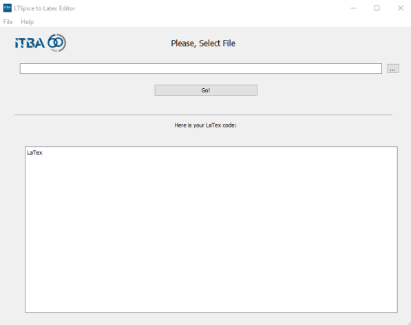
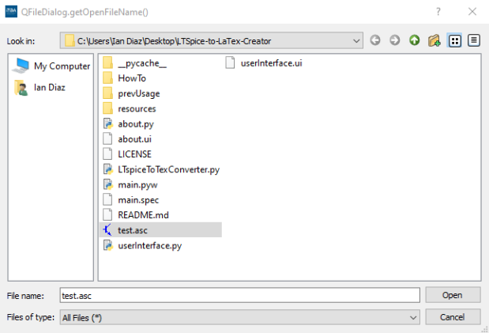
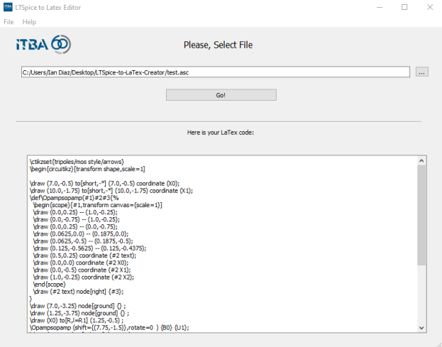

# Convert LTspice to Latex
<a rel="license" href="https://creativecommons.org/licenses/by-sa/4.0/?ref=chooser-v1"></a><br />

Convert LTspice to LaTeX (TikZ)

# Table of contents

* [Setup](#setup)
* [Process](#process)
* [License](#license)

## Setup
>[Table of contents](#table-of-contents)

1. Install Python 3
2. Install LTspice
3. Latex packages: tikz, circuitikz, (amsmath)
4. Install PyQt5

```bash
pip install PyQt5
```

5. Change path in main.pyw to your LTSpice path
 
## Process
>[Table of contents](#table-of-contents)

Once you have installed the packages above, double click the “main.pyw” file. A prompt as shown on the following figure should appear.



Once you oppened the main window, to choose your LTSpice file, you will need to type the path of your file, or
select it in the file manager. To do this, you will click on the '...' button and select a '.asc' file (as shown in the following figure), a test file has been provided in this repository.



Once you’ve selected your file, click the 'Go!' button, and the LaTeX code should appear. You can copy the code generated, or you can save it as a '.tex' file by clicking in File/Save or simply Ctrl+S



## License
>[Table of contents](#table-of-contents)

<a rel="license" href="https://creativecommons.org/licenses/by-sa/4.0/?ref=chooser-v1"></a><br />


<p xmlns:cc="http://creativecommons.org/ns#" xmlns:dct="http://purl.org/dc/terms/"><a property="dct:title" rel="cc:attributionURL" href="https://github.com/iancraz/LTSpice-to-LaTeX-Creator">LTSpice to LaTeX Converter</a> by <a rel="cc:attributionURL dct:creator" property="cc:attributionName" href="https://www.linkedin.com/in/iancraz/">Ian C. Diaz</a> is licensed under <a href="https://creativecommons.org/licenses/by-sa/4.0/?ref=chooser-v1" target="_blank" rel="license noopener noreferrer" style="display:inline-block;">Creative Commons Attribution-ShareAlike 4.0 International</a></p>
